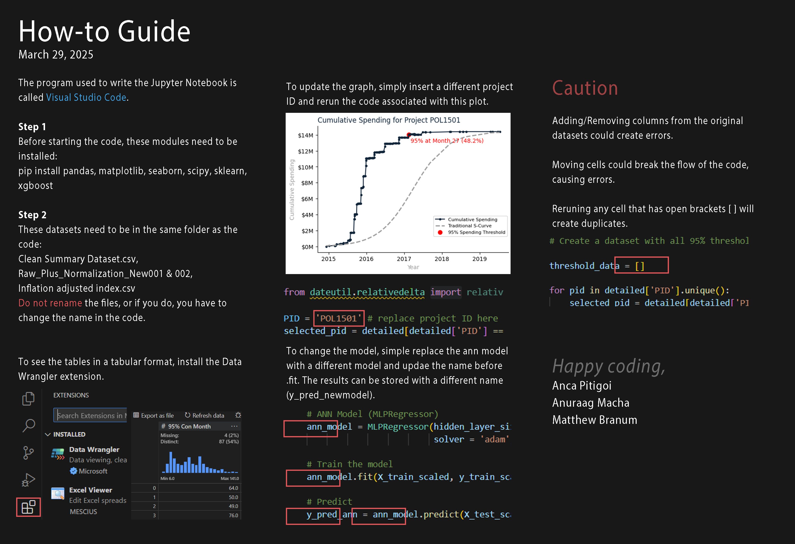

# DCAMM ML Forecasting Project

This project was conducted in partnership with the Division of Capital Asset Management and Maintenance (DCAMM), a Massachusetts government agency, which provided real-world datasets for analysis.

This analysis involved working with a comprehensive dataset related to public project costs, categories, and durations. The focus was on data cleaning, transformation, and applying machine learning models. The data preparation process enhanced data quality by eliminating redundancies, correcting categories, and creating more relevant features. 

While the final model demonstrated strong training performance, overfitting was observed. Moving forward, improving forecasting accuracy could be achieved by incorporating pre-construction variables and higher-level planning data to support earlier-stage predictions, rather than relying on finalized cost records.

## Contents
- `ML_Models/` — Notebooks, raw data (Excel), and transformed datasets (CSV)
- `DCAMM Project Report.docx` — Final project report
- `DCAMM Project Report.pptx` — Slide deck summarizing findings

## Tools Used
- Python (XGBoost, sklearn, pandas)
- Power BI (for final dashboard)
- Microsoft Office Suite
- Jupyter Notebook for cross-collaboration
